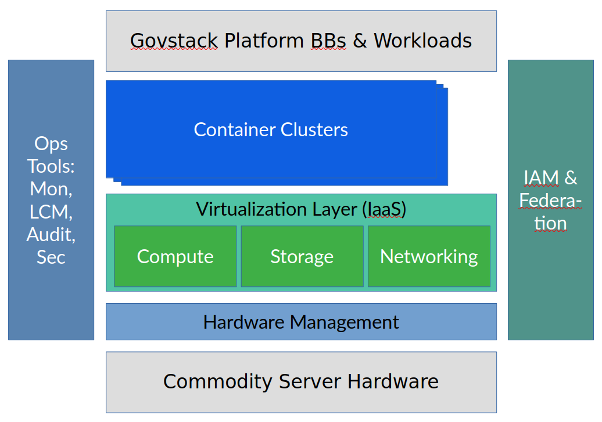

# 2 Description


Set the context of the Building Block for the reader. The description should not assume that the reader has any experience of the GovStack system other than that found on the GovStack website.


This section provides context for this Building Block.

Use-Case for Cloud Infrastructure: Digital services come as Software that needs to be deployed on Hardware. Modern ways of doing this allow for development, test and production deployments to happen in a fully software-defined automated way. The infrastructure must support this and create and connect virtual resources on-demand as prescribed by the automation.

Software to create and operate flexible cloud- and container infrastructure is available as mature open source technology. With guidelines, standardization, hardware and an Operations team, it can be run in any data center on top of commodity server hardware. It can of course also be used by local or global providers to offer the same, compatible technology as a public cloud. This control and transparency over technology allows for a high level of digital sovereignty.

## 2.1. Abstract 

States, societies, companies, and individuals have much to gain by leveraging modern digital cloud-based technology. Yet embracing technology without oversight over dependencies can easily result in situations where digital infrastructure is at the mercy of large foreign entities without any substantial possibility to exercise your own control over it, without any possibility to reflect your own values or to assert your own regulation over it. Vendor lock-in is the opposite of digital sovereignty. Governments need to have the choice and ability to design and control their IT environments and cloud technology to ensure security, independence, and data sovereignty for their citizens. See chapter 5 for considerations on digital sovereignty.

## 2.2. Agile infrastructure for Agile Development 

Software development and operations has advanced significantly over the last two decades; the creation of customer-focused cross-functional fast-moving agile teams has significantly enhanced the speed of innovation and – if implemented right – also the quality of the delivered service.\
To leverage their full potential, such teams need access to pooled infrastructure that can be consumed on-demand via the network with self-service APIs that allow full automation and rapid elasticity in a pay-per-use model. The [2011 NIST definition of cloud-computing](https://nvlpubs.nist.gov/nistpubs/legacy/sp/nistspecialpublication800-145.pdf) reflects this. The empowering effect and the process speed up by allowing developers, testers and operators to create and connect the needed infrastructure via self-service in a fully automated way controlled by software can not be overestimated.

While many organizations have benefitted from gradually adapting their workloads to take advantage of the automation possibilities of cloud computing, the IT industry witnesses a new generation of workloads that has been designed from the ground up to take full advantage of the possibilities of cloud infrastructure; auto-scaling stateless services on-demand to the current level of load and automating a lot of the operational tasks that would otherwise be done manually by operations teams. These workloads are called cloud-native. While the first wave of these were based on virtual machines (VMs), we see a second, larger wave of these that leverage container technologies. In many cases, these containers run on top of virtual machines, thus allowing to balance good developer abstractions and fast scalability (where container technologies excel) with flexibility and isolation requirements (the strength of virtualization technology). In dedicated environments however, it can be beneficial to cut out the complexity of a virtualization layer and to run containers on bare-metal.

In all cases, users of the technology should consider the dependencies on providers of technology and infrastructure and take deliberate decisions on all components of the technology stack required to develop and run their workloads.

<figure><figcaption>
<em>Architecture of the Cloud and Container Building Block. The Hardware and the Platform Building Blocks and Workloads are not part of this BB but were included for completeness. The architecture assumes many container clusters rather than just one for isolation reasons. Platform BBs and Workloads can directly access the IaaS/Virtualization Layer, but most modern ones will be implemented using container technology.</em>
</figcaption></figure>
