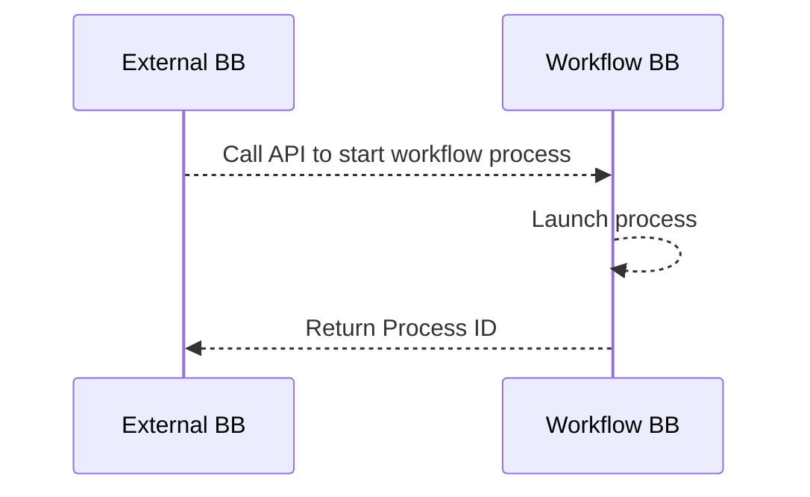
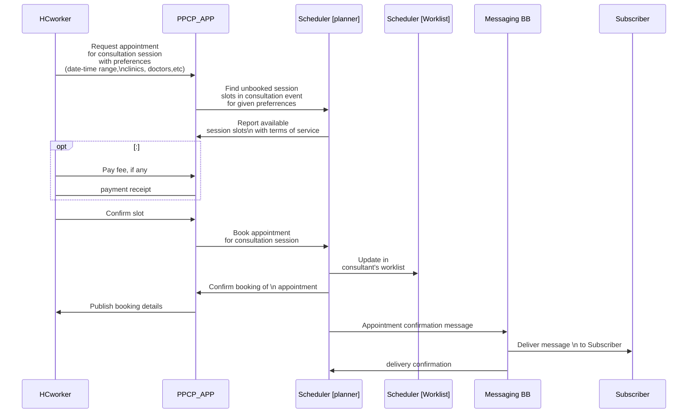

# 9 Internal Workflows


This section describes standard _internal_ workflows that a building block should support. Each internal workflow must be linked to one of the Functional Requirements defined in section 6.

An internal workflow describes the internal processes that a Building Block needs to execute to complete a request from an external application or Building Block to fulfull the functional requirement


_\<Example Internal Workflows>_

### 9.1 Start a workflow process via API.&#x20;

This internal workflow is used by the Workflow Building Block to initiate a workflow process. An external application (Building Block) calls an API in the Workflow Building Block which will launch a workflow process. This functional requirement must also support submission of data payload through variables in the same API call.

Examples:&#x20;

* [PostPartum and Infant Care Use Case, Payment Step](https://govstack-global.atlassian.net/wiki/spaces/GH/pages/49381394/PostPartum-01-Example+Implementation+Original+-+multiple+steps): Validate the mother has completed all steps (visited a pediatrician, procured medicine and nutrition supplies, and visited the therapy center) by connecting to MCTS registry
* [Unconditional Social Cash Transfer, Elibility Determination](https://govstack.gitbook.io/product-use-cases/product-use-case/inst-1-unconditional-social-cash-transfer): Send beneficiary data from Registration BB to Workflow BB

### 9.2 Booking an appointment&#x20;

The first and somewhat unique use-case is related to the need for consent when the Individual is not yet provisioned in the System processing the data. In such cases, the workflow requires the creation of a valid and trusted Foundational ID to be linked with the Consent Record. Below is shown how a pre-registration use of consent workflow works.

Examples:&#x20;

* Postpartum Use Case, Appointment scheduling step: In this case, a health care worker will book an appointment into a specific slot. The Scheduler Building Block will leverage the Messaging Building Block to send a message to the patient with an appointment confirmation.

